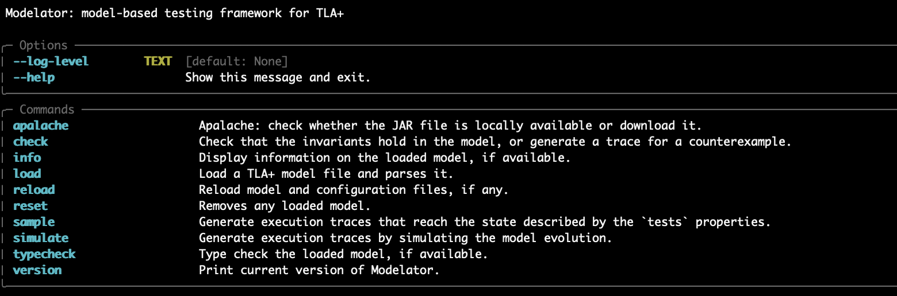

# Modelator

[](LICENSE)
[](https://pypi.org/project/modelator)
[](https://github.com/informalsystems/modelator/actions/workflows/python.yml)

Modelator is a tool that enables automatic generation of tests from models.
Modelator takes [TLA+ models](https://mbt.informal.systems/docs/tla_basics_tutorials/tutorial.html) as its input and generates tests that can be run against an implementation of the model.

Under the hood, Modelator uses [Apalache](https://apalache.informal.systems/), our in-house model checker, to generate tests from models.

Modelator is used by [Atomkraft](https://github.com/informalsystems/atomkraft), a testing framework for the [Cosmos blockchains network](https://cosmos.network/).

# Installing Modelator

First, make sure your system has

- `Python 3.8` or newer
- `Java 17` or newer

To install Modelator, simply run `pip install modelator`.
That's it! Please verify that the tool is working by writing `modelator` on the command line.
You should see something like this:



For detailed installation instructions and clarifications of dependencies, check [INSTALLATION.md](INSTALLATION.md)

# Using Modelator

For a full example of running Modelator together with the system implementation and the corresponding TLA+ model, see the [Towers of Hanoi example](examples/hanoi).

To see all commands of the Modelator CLI, run `modelator --help`.

The command `apalache` provides the info about the current version of Apalache installed and enables you to download different versions.
(In order to check the usage of this command, run `modelator apalache --help`.
Do the same for details of all other commands.)

Commands `load`, `info`, and `reset` are used to manipulate the default value for a TLA+ model.
(A default version is not strictly necessary since a model can always be given as an argument.)

The most useful commands are `simulate`, `sample`, and `check`.
Command `simulate` will generate a number of (randomly chosen) behaviors described by the model.
If you would like to obtain a particular model behavior, use command `sample`: it will generate behaviors described by a TLA+ predicate.
Finally, to check if a TLA+ predicate is an invariant of the model, use `check`.
To see all the options of these commands, run `modelator simulate --help`, `modelator sample --help`, or `modelator check --help`.

## Contributing

If you encounter a bug or have a an idea for a new feature of Modelator, please submit [an issue](https://github.com/informalsystems/modelator/issues).

If you wish to contribute code to Modelator, set up the repository as follows:

```
git clone git@github.com/informalsystems/modelator
cd modelator
poetry install
poetry shell
```

## License

Copyright © 2021-2022 Informal Systems Inc. and modelator authors.

Licensed under the Apache License, Version 2.0 (the "License"); you may not use the files in this repository except in compliance with the License. You may obtain a copy of the License at

    https://www.apache.org/licenses/LICENSE-2.0

Unless required by applicable law or agreed to in writing, software distributed under the License is distributed on an "AS IS" BASIS, WITHOUT WARRANTIES OR CONDITIONS OF ANY KIND, either express or implied. See the License for the specific language governing permissions and limitations under the License.
