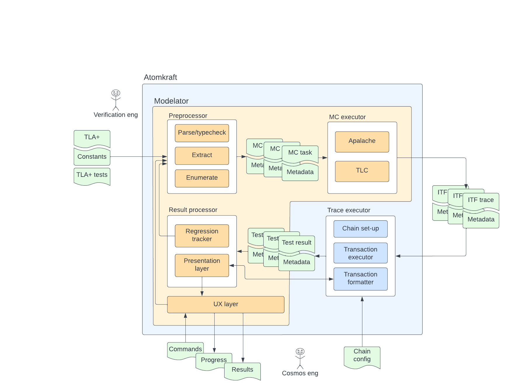

# ADR-002: Preprocessing User-Defined Files into Model Checker Inputs

## Summary

In this ADR we want to define the _preprocessor module_. This module takes as its input user-defined files (a TLA+ model, other files defining behaviors or constants) and outputs metadata and a format that could directly be given to a model checker.

We leave out from this document how the parameters to the command are given (this is in the scope of UX layer)

## Context

The context is given by this architecture sketch:
.
In this document, we are defining closely the upper-left part, titled _Preprocessor_ in the sketch.

The main task of the Preprocessor is to extract tests and formulate them as invariants (creating a negated predicate of the test predicate).
Furthermore, beside Modelator's basic concern, which is running tests, we also aim to support checking basic invariants of a model.

## Assumptions

We assume that the module has access to the following arguments:

- `model`: a TLA model of the problem
- `init`: a predicate defining initial state
- `next`: a predicate defining transitions
- `constants`: a list of mappings between constants (as defined in `model` and actual values these constants are getting). It is a list in order to enable multiple tests (with different constant values)
- `behaviors`: a list of predicates that describe behaviors for which test traces need to be generated (applicable for command which generates test traces)
- `invariants`: a list of predicates that describe basic invariants that need to hold true for the model (applicable for command which checks if the basic invariants of the model hold)
- `checker`: either `apalache` or `tlc`.
- `command`: either `sample` or `check`.
- `checker-specific-params`: parameters of a particular model checker (Apalache or TLC).

## Proposed Solution

The preprocessor module creates:

- `<model_name>_MC.tla` file which extends the original `model` and creates negated `behaviors` predicates
- `<model_name>_MC.cfg` files which contain the information about `behaviors` or `invariants` to run, `init` and `next` predicates, and `constants` values

It identifies all dependent files of the original `model` file.

The output of the module is a JSON object containing:

```json
{
"checker": "<apalache|tlc>",
"model": "<model_name>_MC.tla",
"files":
    {
        "<file_name_1>":"<file_content_1>",
        "<file_name_k>":"<file_content_k>"
    },
"checks":
    {
       "<predicateName_constantsElementNum>":"<name_of_config_file>.cfg">
    },
"timestamp": "datetime"
}
```

In this JSON, the field `checks` corresponds to individual runs of model checkers.Each run of a model checker corresponds to an element of the cross-product of predicates that the user wants to check and constants.

The JSON also contains contents of all files that are relevant for running, including the generated `.cfg` files.
