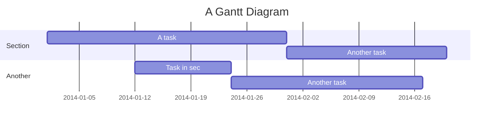

# Jekyll Website for Model Based Testing

The website is live at [https://mbt.informal.systems](https://mbt.informal.systems)

## Description

The website is built using [`jekyll`](https://jekyllrb.com) and the sources are contained inside `jekyll` directory.

The pages are written in Markdown format supporting some [extra](https://github.com/pmarsceill/just-the-docs) [features](https://github.com/jeffreytse/jekyll-spaceship).

## Publishing

The website is always compiled and served from the latest `main` branch using [Github workflow](https://github.com/informalsystems/modelator/blob/main/.github/workflows/ghpages.yml).

_So, don't push any imcomplete changes to the `main` branch._

To see your changes, compile locally.

```sh
git checkout -b new_page # to create a new branch
cd jekyll
# make sure `bundle` is installed
bundle install
bundle exec jekyll serve
# add `-w` option to recompile automatically the files are changed
# when you are finished, push the commits to new_page branch
```

## Maintainance

As discussed above, to add new changes or pages to the website, we need to update `main` branch. As per our [contribution guide](/CONTRIBUTING.md), please follow the rules of opening a PR to `main`.

## Creating new pages

0. We write pages using `Markdown` syntax. The files are named `*.md`.
1. Each page must start with a [front matter](https://jekyllrb.com/docs/front-matter).
    - It is a code block with `yaml` data wrapped with `---`. It contains the necessary information for `jekyll` to compile the markdown file. It looks like this,
        ```
        ---
        title: Homepage
        layout: default
        ---
        ```
2. It must mention these following `variables`.
    - `title` - title of the page
    - `layout` - jekyll layout. just use `default` if you do not know what to use.
    - Other useful `variables` for our websites are,
        - `nav_order` - orders the title in TOC.
        - `has_children` - mentions the page has child pages.
        - `parent` - mentions who's the parent of this child page.
        - `grand_parent` - mentions who's the grand parent of this child page
        - [more](https://pmarsceill.github.io/just-the-docs/docs/navigation-structure) - `just-the-doc` reference

3. Write your page in `markdown` format; probably using [some of the extra features](https://github.com/jeffreytse/jekyll-spaceship).

4. Verify everything compiles using `bundle exec jekyll serve` and check the website on localhost.

5. Push the changes to your branch.

### Structuring

Normally the new files can be anywhere as long as they are properly related by `parent`, `grand_parent` and `has_children` variables.

Also `just-the-doc` supports [some customizations](https://pmarsceill.github.io/just-the-docs/docs/navigation-structure).

## Sample page

```
> cat blogs.md
---
title: Blog posts
layout: default
parent: Homepage
nav_order: 2
---

# Welcome to my blogs.
```

## Light CheatSheat

### Emoji

You can type any emoji like this `:smile: :smiley: :cry: :wink:`

> See full emoji list [here](https://www.webfx.com/tools/emoji-cheat-sheet/).

### Embedding

```



```

### MathJax

You can render *LaTeX* mathematical expressions using **MathJax**, as on [math.stackexchange.com](https://math.stackexchange.com/):

```
The *Gamma function* satisfying $\Gamma(n) = (n-1)!\quad\forall n\in\mathbb N$ is via the Euler integral

$$
x = {-b \pm \sqrt{b^2-4ac} \over 2a}.
$$

$$
\Gamma(z) = \int_0^\infty t^{z-1}e^{-t}dt\,.
$$
```

> More information about **LaTeX** mathematical expressions [here](https://meta.math.stackexchange.com/questions/5020/mathjax-basic-tutorial-and-quick-reference).

### Diagrams

#### UML Sequence Diagrams

You can render sequence diagrams like this:

```plantuml!
Alice->Bob: Hello Bob, how are you?
Note right of Bob: Bob thinks
Bob-->Alice: I am good thanks!
Note left of Alice: Alice responds
Alice->Bob: Where have you been?
```
#### Mermaid



## Dev details

Theme: `just-the-docs` ([Github](https://github.com/pmarsceill/just-the-docs), [Usage](https://pmarsceill.github.io/just-the-docs))\
Jekyll plugin: `jekyll-spaceship` ([Github](https://github.com/jeffreytse/jekyll-spaceship), [Usage](https://github.com/jeffreytse/jekyll-spaceship#usage))
